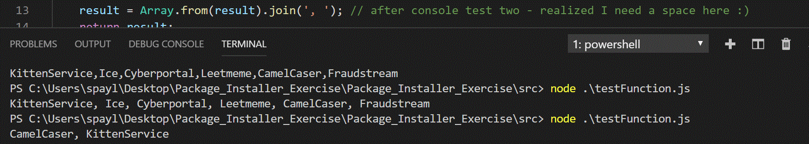
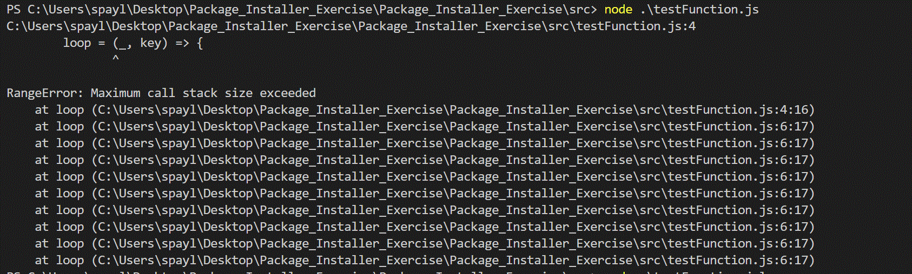
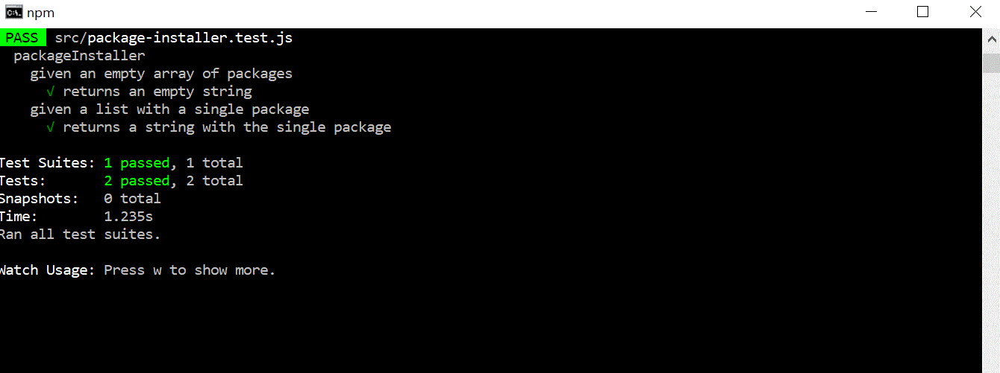
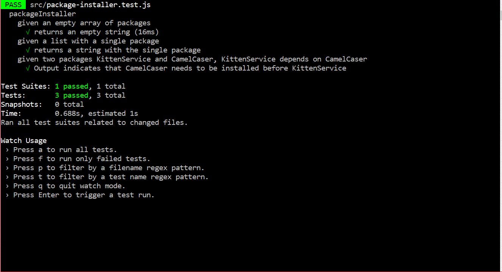
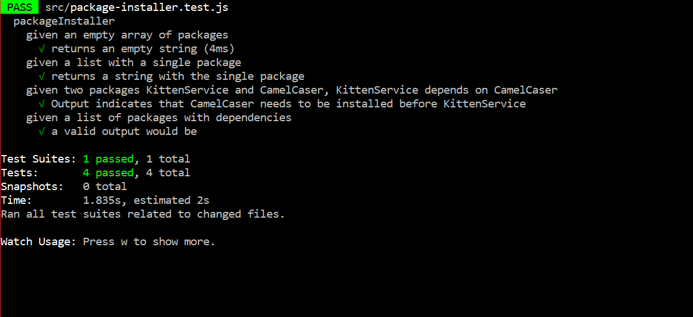
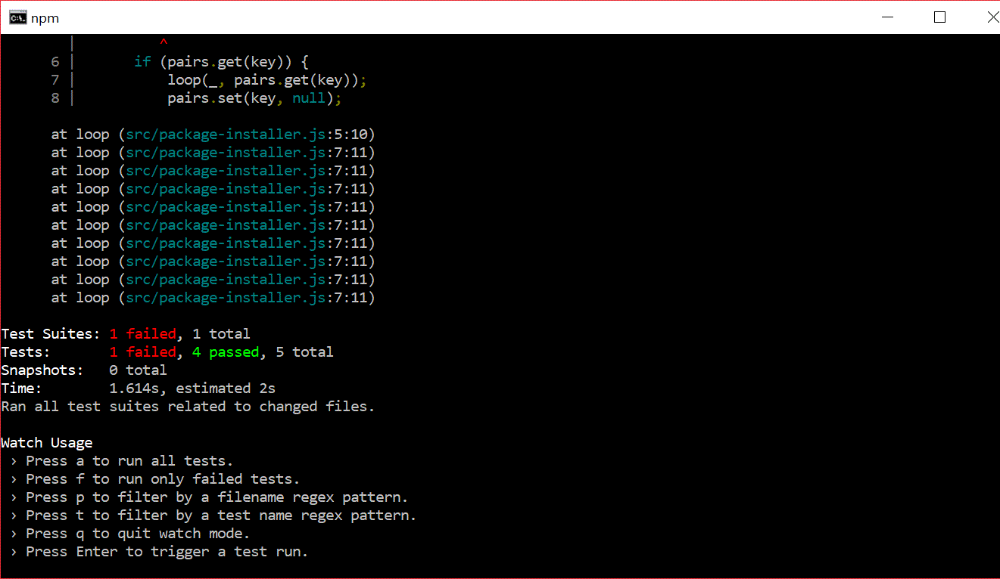

# Package_Installer_Exercise
Creating a package installer that can handle dependencies.  Write the code that will determine the order of install.

## Tests in console

Started by testing PackageInstaller function in the console.

Invalid input test in the console.

## Tests using jest

Two working tests.

Three working tests.

Four working tests.

Inavlid input.

